# Material 3 Expressive 界面改版

2026-09-12。以“对弈／棋谱两区＋头像入口”组织所有平台。源码与本次构建记录适用于 `main`；v1.0.0 的既有发行文件对应此前界面。

## 设计依据

- [Material 3 Expressive](https://m3.material.io/blog/building-with-m3-expressive)：紫色主操作区、次色状态、第三色结算、饱满按钮、分组圆角和短促弹性反馈。
- [Material 一级标签页](https://m3.material.io/components/tabs/guidelines)：对弈与棋谱是两个主要目的地；账户和设置从头像进入。
- [Google Photos 账户与设置入口](https://support.google.com/photos/answer/6193313?hl=en&co=GENIE.Platform%3DAndroid)：个人身份与偏好在头像下集中管理。
- [Google 窗口尺寸规范](https://developer.android.com/develop/ui/compose/layouts/adaptive/use-window-size-classes)：600、840 逻辑像素断点，另处理短横屏。

继续使用 Noto Sans SC，并按中英文调整字距、行高。`design/theme.dart` 管理颜色角色、字体、组件主题；`design/tokens.dart` 管理间距、圆角、动效、断点和平台能力。棋盘保持中性色，黑白棋子、预选轮廓、当前轮次文字及获胜连线共同表达状态。

## 页面与交互

| 区域 | 改版行为 |
| --- | --- |
| 主界面 | 全平台两个顶部标签。切换标签保留棋谱筛选与滚动位置；头像在手机打开底部面板，在大屏打开就近菜单。 |
| 对弈首页 | 开局／续局面板，优先恢复活跃联机房间，其次为未完成本地对局；好友对弈入口和紧凑最近棋谱。 |
| 好友对弈 | 一个页面创建或加入，邀请链接预填房间码；等待房间突出六位码、复制邀请、双方座位与准备状态。 |
| 账户 | 游客说明、登录／注册、邮箱验证和找回密码分步展示；字段错误就近显示；进行中的房间说明身份切换限制。 |
| 设置 | 外观、对局、语言与无障碍分组；主题与语言弹层选择，开关直接生效；系统配色和触感按实际平台能力显示。 |
| 棋谱 | 按日期分组，包含双方、结果、时间、手数、棋盘缩略图；保留全部／本地／联机筛选，并就近显示同步错误与重试。 |
| 对局 | 独立紧凑标题栏，手机完整方形棋盘＋固定确认操作；横屏和大屏按宽高共同限制棋盘，侧栏独立滚动。 |
| 复盘 | 主要空间用于棋盘，滑块和首尾／前后／播放集中呈现。方向键切步，Home／End 到首尾，Space 播放／暂停。 |

`AppShell`、`SectionScaffold` 和 `GameScaffold` 分别负责主页面、二级页面和对局。所有原有路由地址继续有效；二级页返回原入口，直接深链进入时回到首页或棋谱。推入的页面会更新 Web 地址栏，刷新与浏览器前进／后退均可恢复。

`BoardInteractionController` 让手机与侧栏共享预选、提交、确认和取消。触屏先选再确认，鼠标点击直接落子，方向键移动、Enter／Space 落子、Escape 取消；局面改变、不可落子或断线会清除预选。重复确认只提交一次。

对局返回首页保留座位与棋局；主动退出房间时明确确认认输后果。悔棋协商、重连倒计时和提交过程影响相应按钮状态。结算反馈每局在当前应用会话内播放一次，并服从应用及系统减少动画设置。窗口旋转保留棋局、预选与复盘进度。复盘订阅持久化记录，处理刚结束棋局稍晚保存的情况。

标准按钮触控区域至少 48×48。225 个棋盘交叉点均有语义标签；小屏交叉点通过预选、坐标反馈和读屏操作辅助定位。大字体允许滚动，未缩小正文以强行塞入固定高度。

## 前后对比

“改版前”来自 v1.0.0 的浏览器验收截图，“改版后”来自本次发布模式 Web 和真实后端的浏览器运行。对比图片使用相同窗口尺寸，棋局内容可不同。

[手机对局并排对比](images/ui-redesign/comparison-phone.png)。

| 页面 | 改版前 | 改版后 |
| --- | --- | --- |
| 桌面首页 | 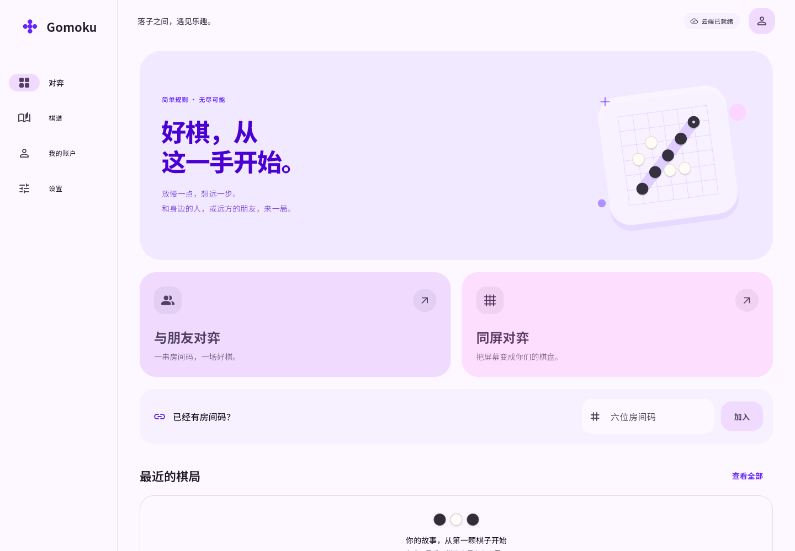 | 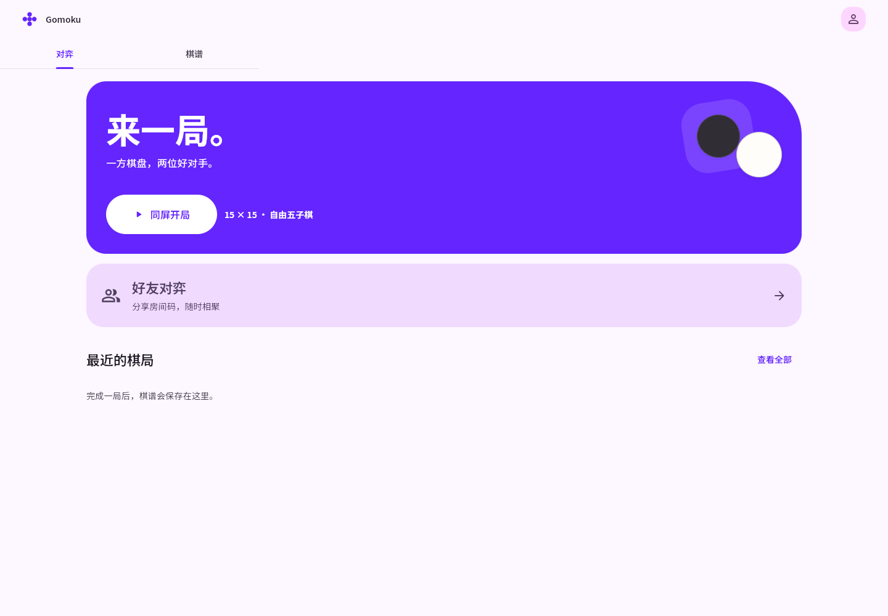 |
| 手机联机 | 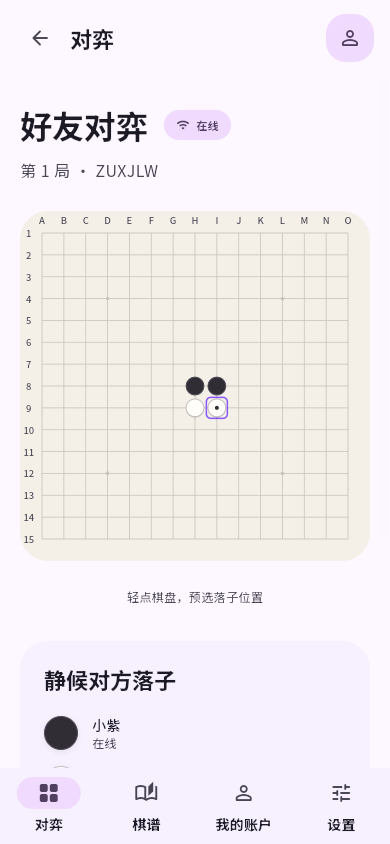 | 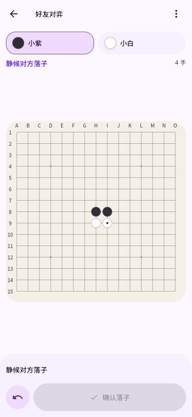 |
| 桌面对局 | 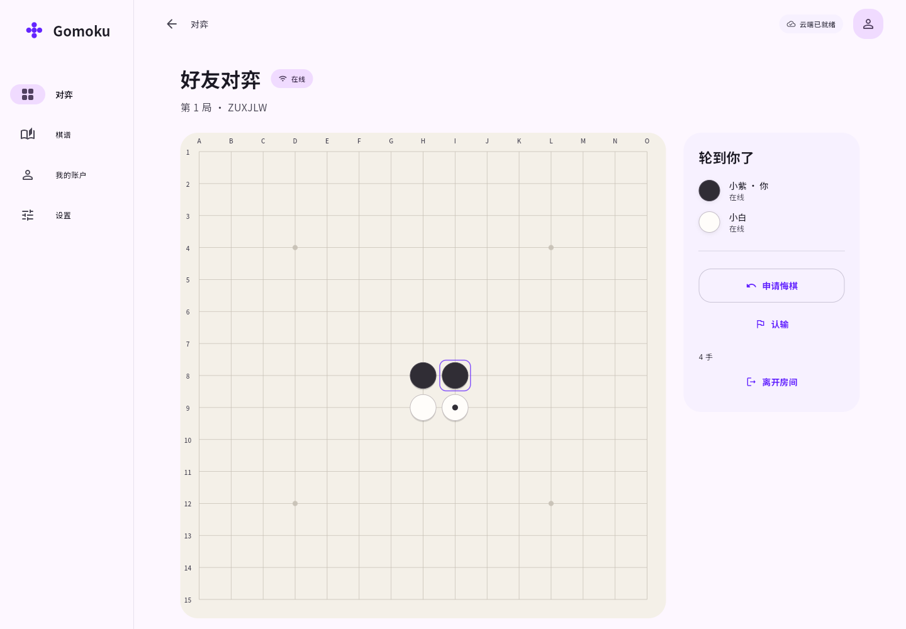 | 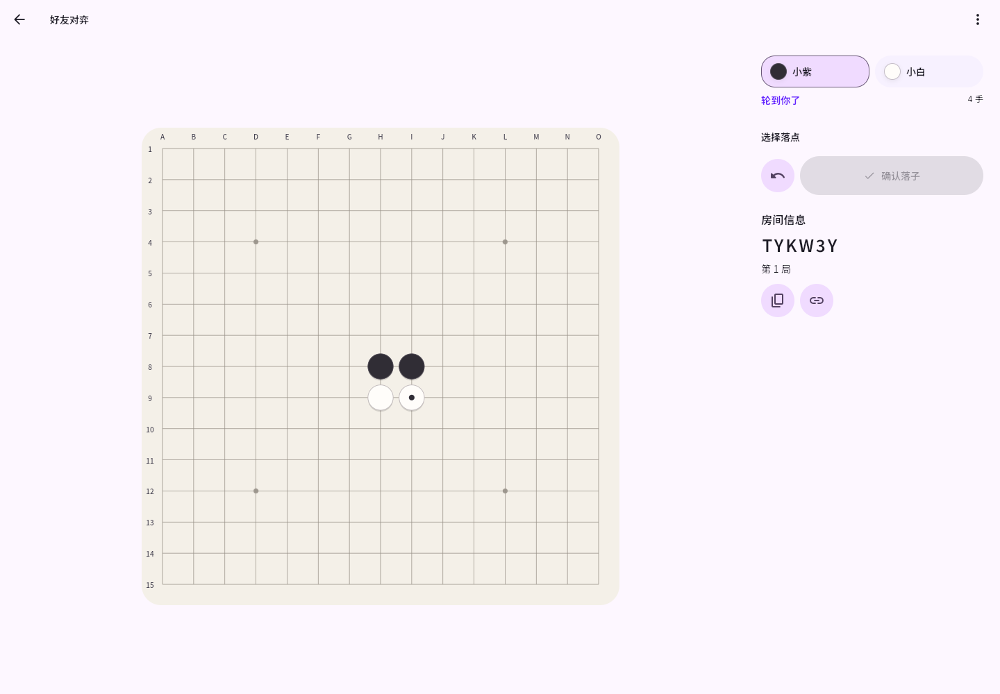 |
| 深色设置 | 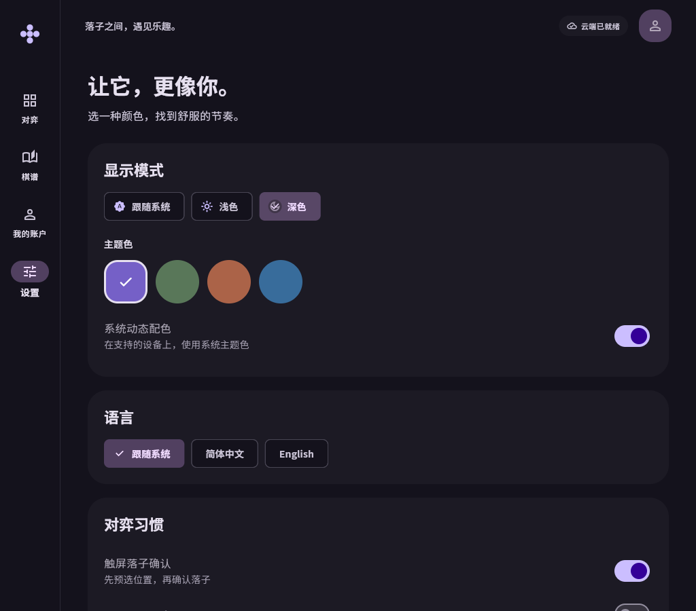 | 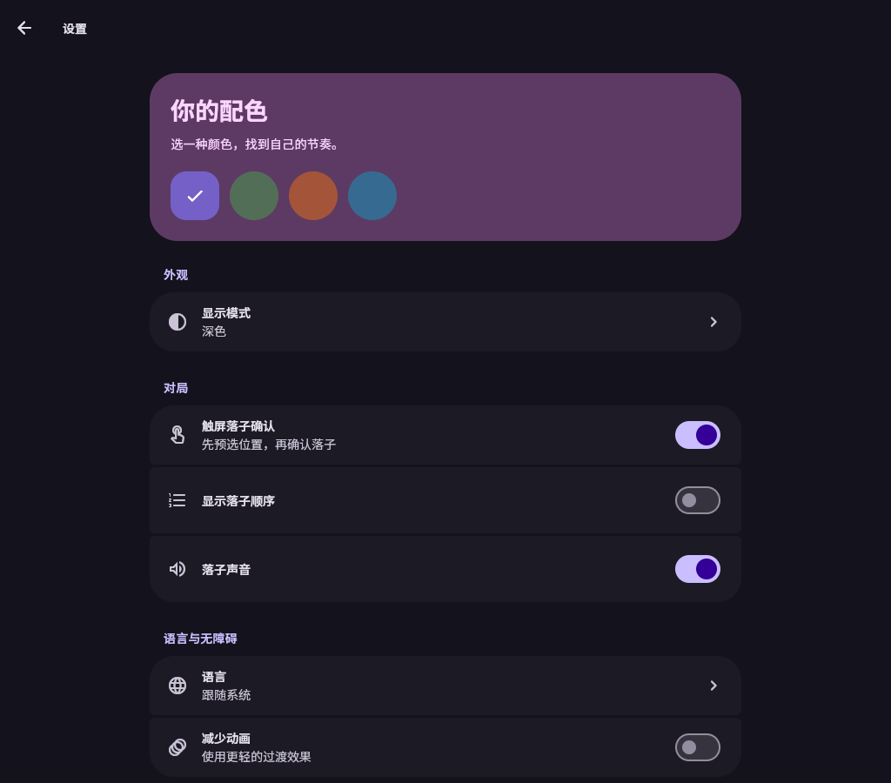 |

更多页面：

| 360×640 本地对局 | 等待房间 | 棋谱 | 复盘 |
| --- | --- | --- | --- |
| 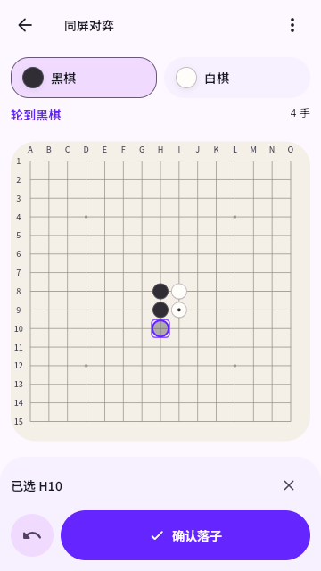 | 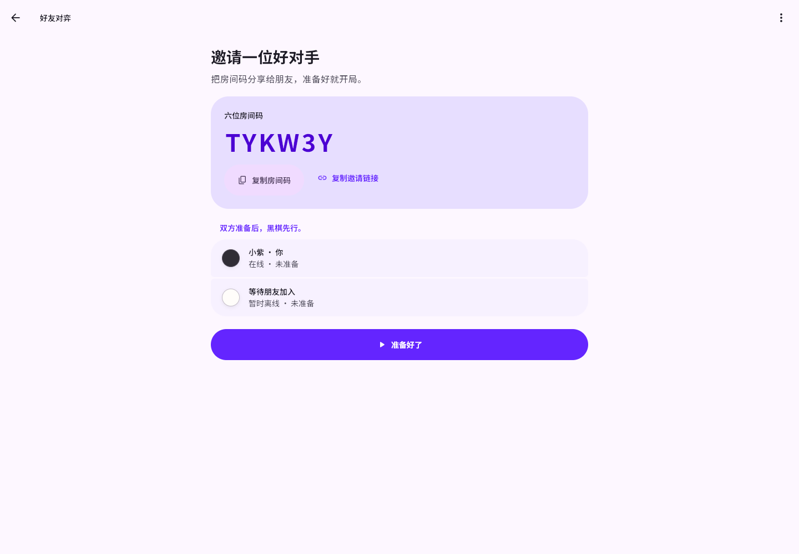 | 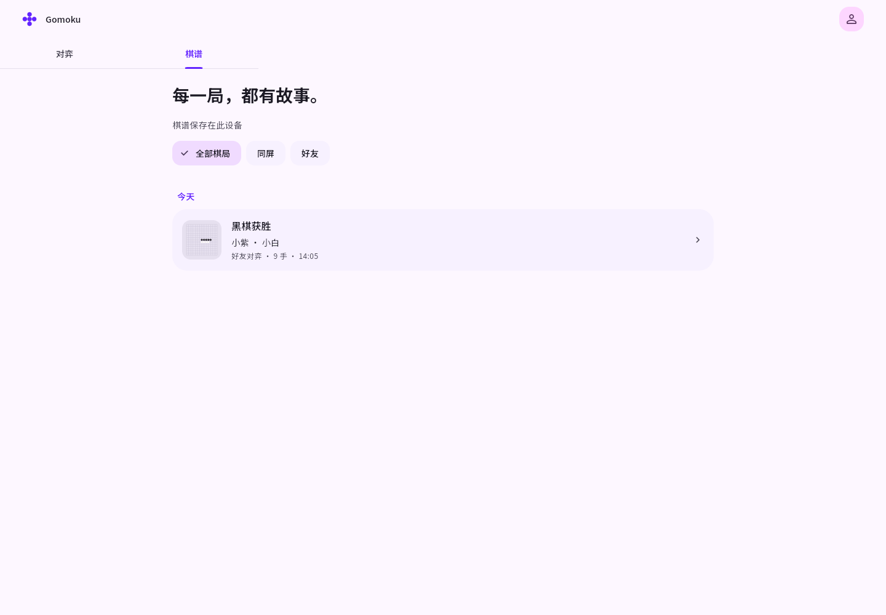 | 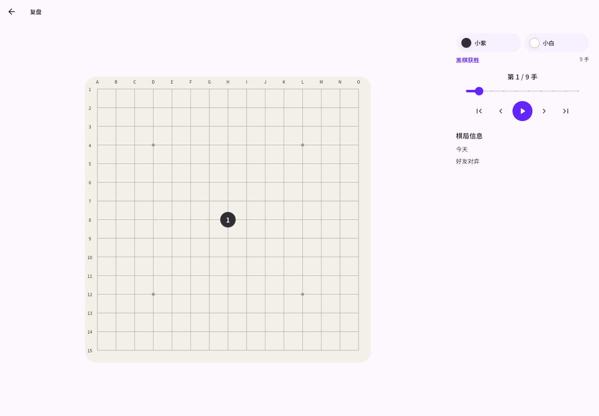 |

| 手机首页 | 手机设置 | 账户 | 手机结算 |
| --- | --- | --- | --- |
| 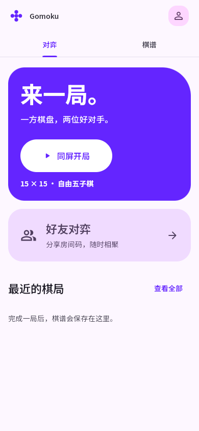 | 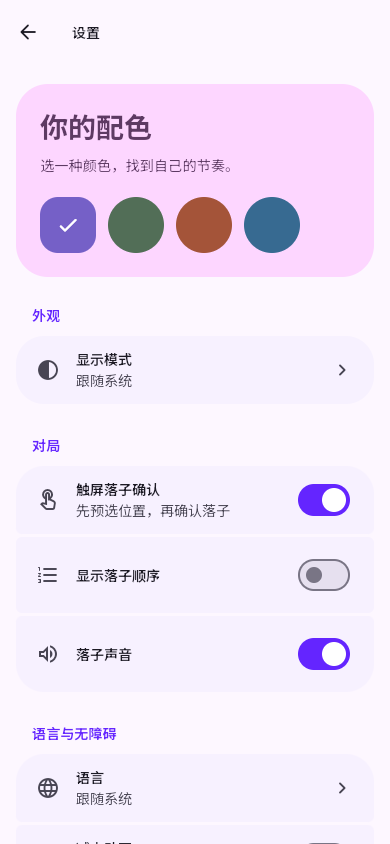 | 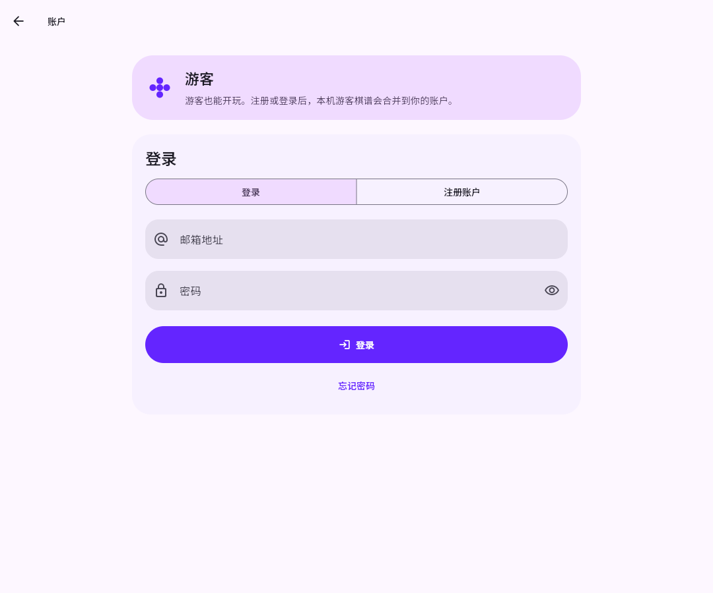 | 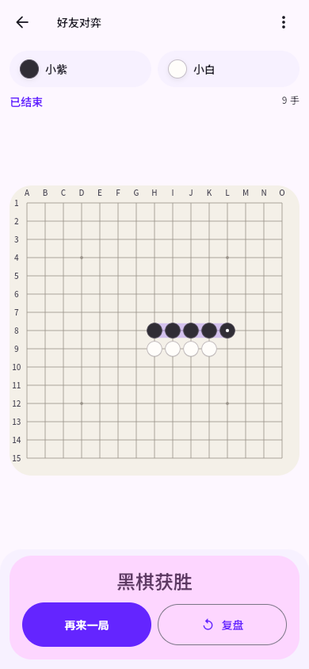 |

[手机复盘完整截图](images/ui-redesign/replay-phone.png)。

## 自动验收

执行入口为 `tool/check.ps1 -WithBackend`、`tool/browser/verify.mjs` 和 `.github/workflows/ci.yml`。本机日志不提交；CI 上传浏览器截图、运行结果和日志至 `verification` artifact。

本机完整检查已通过：格式、静态分析、95 个共享 hosted 依赖一致性、12 项规则测试、39 项 Flutter／SQLite 测试、11 项真实后端测试。

- 布局：360×640、390×844、844×390、900×1200、1440×1000；599／600 与 839／840 断点；中英、深浅色及双倍字号。
- 首屏：360×640 常规字号下完整棋盘、轮次和确认可见，预选不改变棋盘位置；双倍字号所有操作可滚动到达。
- 导航／状态：头像入口、设置持久化、标签筛选与滚动保留、二级页返回、深链回退、返回续局、主动退出确认、暂停清除预选、悔棋协商、账号切换限制、密码就近错误。
- 棋盘／复盘：触屏、鼠标、键盘、225 点语义、异步重复确认、旋转保留预选、快捷键复盘和迟到的棋谱保存。
- 后端：使用真实 PostgreSQL、Redis、Mailpit 和两个 Serverpod 实例，回归幂等、并发、完整棋局、满房、房间过期、断线／重启、跨实例广播、注册／找回、游客归并、重复同步、会话撤销及账号隔离。

浏览器与六端构建的最终运行链接、结果及实机边界见 [验证记录](VALIDATION.md)。这些自动检查不代表真人屏幕阅读器、触屏手感或六种实体设备均已验收。
